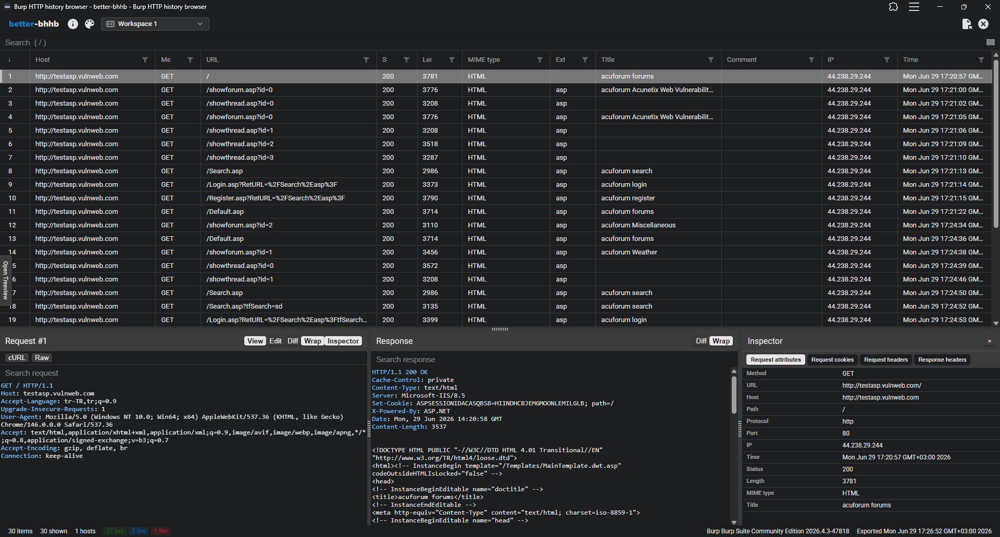

# Better-BHHB

Better Burp HTTP history browser — a fork of [BHHB](https://github.com/adityatelange/bhhb).

View HTTP history exported from Burp Suite Community Edition (CE).

➡️ **https://better-bhhb.pages.dev**

## Disclaimer

This is an independent fork of the original bhhb project created by Aditya Telange. better-bhhb is hosted and maintained separately and is **not affiliated** with the original author. All credit for the original idea and source code goes to [Aditya Telange](https://github.com/adityatelange).

The project is available at:
- GitHub: [https://github.com/rizakara/better-bhhb](https://github.com/rizakara/better-bhhb)
- Live demo: [https://better-bhhb.pages.dev](https://better-bhhb.pages.dev)

## What problem does this solve?
- `Burp Suite Community Edition` has one BIG feature paywalled - Disk-based projects 💾.
- Because of which Community Edition users cannot save their `HTTP history` and Sitemap info, which are destroyed after the temporary session is closed 🗑️.
- Although this is a thing, users can export their Burp CE's HTTP history by *selecting the records* (Ctrl+A) and using **`Save items`** 💾 option in context menu of `Proxy->HTTP history` or `Target->Sitemap` or `Logger`.
- Using that Burp will export the HTTP history along with Requests and Responses into a *XML file*.
- **`Better-BHHB`** can open these exported items, parse it and display them in a well-formatted manner. 📋
- This application is a [`PWA`](https://developer.mozilla.org/en-US/docs/Web/Progressive_web_apps), which can be installed in any chromium based browser and could run offline, with all of the processing done on device itself ⚙️.
- Linked Forum thread - [How do I view items export from Burp's proxy's history?](https://forum.portswigger.net/thread/how-do-i-view-items-export-from-burp-s-proxy-s-history-0ae0f99e)

<kbd></kbd>
